# 🛠️ OneShield: Day 2 Operations & Maintenance Manual

Enterprise Site Reliability Engineering (SRE), continuous model governance, container security maintenance, and incident response procedures for the **OneShield Autonomous Vulnerability Remediation Engine** deployed on **Google Kubernetes Engine (GKE Autopilot)**.

---

## 1. Day 2 Architectural Operations Topology

```mermaid
flowchart TD
    subgraph "1. Threat Intelligence Synchronization"
        CISA["CISA KEV Feed (Daily)"] --> CronJob["threat-intel-sync (K8s CronJob)"]
        EPSS["FIRST.org EPSS Feed (Daily)"] --> CronJob
        CronJob --> Redis[("Redis Cluster<br/>redis-master.default:6379")]
        Redis -.->|"Sub-ms In-Process Read-Through TTL"| Jev["Jev System 1 Engine<br/>(oneshield-app)"]
    end

    subgraph "2. Continuous LoRA Governance & Hot-Swap"
        Feedback["Human Approvals & New CVEs"] --> Train["Fine-Tuning Pipeline"]
        Train --> EvalGate{"Automated Gate<br/>(>=90% Safety & AST)"}
        EvalGate -->|Pass| GCS["GCS Bucket<br/>gs://oneshield-llm-weights/lora/"]
        GCS --> HotSwap["SGLang Dynamic Hot-Swap<br/>(Zero-Downtime, No Pod Restart)"]
    end

    subgraph "3. Supply Chain Security & Container Lifecycle"
        DepBot["Dependabot / Renovate"] --> PR["Dependency Bump PR"]
        PR --> HITL["Security Engineer Human Review"]
        HITL -->|Approved & Merged| Build["Nightly CI Action"]
        Build --> Trivy{"Trivy Scan<br/>(0 High/Critical)"}
        Trivy -->|Pass| Cosign["Cosign Keyless Signing"]
        Cosign --> Kyverno["Kyverno In-Cluster Admission"]
    end

    subgraph "4. Queue Resilience & Incident Routing"
        Scanners["Security Scanners"] --> PubSubQueue["vulnerability-scan-queue"]
        PubSubQueue --> Worker["oneshield-app Worker"]
        Worker -->|5x Delivery Failures| DLQ["vulnerability-scan-dlq"]
        DLQ --> P1["P1 Alert (PagerDuty / Call)"]
        Worker -.->|"Circuit Breaker > 5%"| P2["P2 Alert (Email: appsec-team@bank.com)"]
    end
```



---

## 2. Threat Intelligence Maintenance (CISA KEV & EPSS)

### 2.1 In-Cluster Redis Architecture
* **Cluster Service**: `redis-master.default.svc.cluster.local:6379`
* **CronJob Manifest**: `k8s/operations/threat-intel-sync-cronjob.yaml`
* **Schedule**: Daily at 02:00 UTC (`schedule: "0 2 * * *"`)

### 2.2 Ingestion & Cache Mechanics
1. **Sync Execution**: The `threat-intel-sync` CronJob downloads the latest CISA KEV JSON catalog and FIRST.org EPSS scores.
2. **Atomic Write**: Populates Redis set `cisa:kev:catalog` and sets key `cisa:kev:last_sync`.
3. **Local In-Process Cache with Read-Through TTL**:
   - `JevEngine.is_in_cisa_kev()` queries the local in-memory set in $< 100\,\text{ns}$.
   - If the in-memory cache age exceeds `CISA_KEV_TTL` (6 hours), it refreshes from Redis automatically.
   - If Redis is unreachable, Jev logs a warning and falls back to the static fallback catalog without crashing.

### 2.3 Manual Trigger & Verification
```powershell
# Manually trigger the CronJob for immediate threat intel refresh
kubectl create job --from=cronjob/threat-intel-sync manual-threat-sync-01 -n default

# Verify in-cluster Redis key populated
kubectl exec -it deployment/oneshield-api-gateway -n default -- redis-cli -h redis-master.default SCARD cisa:kev:catalog
```

---

## 3. Continuous LoRA Model Retraining & Hot-Reloading

As new language frameworks (e.g. Spring Boot 3.3, Oracle 23c) or remediation feedback loops generate training data, LoRA adapters are retrained and hot-swapped without tearing down GPU pods.

### 3.1 Automated Evaluation Gate
Prior to promotion, candidate LoRA adapters must pass the evaluation benchmark:
* **Lexical AST Syntax Integrity**: $\ge 98\%$
* **Jev Gate 3 Safety Score**: Average $\ge 0.90$
* **Regression Failure Rate**: $\le 2\%$

### 3.2 Zero-Downtime Hot-Reload Procedure
1. Sync newly trained weights to Cloud Storage:
   ```bash
   gcloud storage cp -r ./dist/oracle-sql-v2 gs://oneshield-llm-weights-87d68625/lora/oracle-v2/
   ```
2. Trigger SGLang's dynamic adapter reload API via internal service endpoint:
   ```bash
   kubectl exec -n ai-stack deployment/oneshield-app -- python3 -c "
   import requests
   res = requests.post(
       'http://sglang-service.ai-stack.svc.cluster.local:8000/load_lora_adapter',
       json={'adapter_name': 'oracle-sql', 'adapter_path': '/mnt/gcs-weights/lora/oracle-v2'}
   )
   print(res.status_code, res.text)
   "
   ```
3. Verify that SGLang immediately routes subsequent requests using the new LoRA weights while active GPU memory remains stable.

---

## 4. Supply Chain Security & Container Patching

### 4.1 Dependency Governance
* **Dependabot / Renovate**: Configured to open automated pull requests for minor/patch dependencies weekly.
* **Human-in-the-Loop Review Requirement**:
  - Security and development leads must review dependency changes.
  - Pull requests require **at least 1 human approval** before merging into `main`.

### 4.2 Automated Signed Build Pipeline
When a dependency PR is merged into `main`:
1. **GitHub Actions (`app_deploy.yml`)** builds the Docker image.
2. **Trivy Container Scanner** runs:
   - Any `CRITICAL` or `HIGH` CVE with an available fix fails the build (`exit-code: 1`).
3. **Cosign Keyless Signing**:
   - Signs the image digest using GitHub OIDC identity.
4. **Kyverno Admission Policy**:
   - The in-cluster Kyverno controller blocks any deployment whose signature does not match `https://github.com/jagat1980/vulnerability-management-localmodel-fineturning`.

---

## 5. Queue Resilience & Poison Message Handling (DLQ)

### 5.1 Architecture & Dead-Letter Trigger
* **Main Queue**: `projects/project-517889ec-8518-4856-a51/topics/vulnerability-scan-queue`
* **Dead-Letter Queue (DLQ)**: `projects/project-517889ec-8518-4856-a51/topics/vulnerability-scan-dlq`
* **DLQ Subscription**: `projects/project-517889ec-8518-4856-a51/subscriptions/vulnerability-scan-dlq-sub`

If an unparseable payload, malformed scanner event, or unhandled exception occurs 5 consecutive times:
1. Google Cloud Pub/Sub routes the message to `vulnerability-scan-dlq`.
2. The main subscription acknowledges the message, unblocking consumer workers.
3. A **P1 PagerDuty incident** is triggered.

### 5.2 Poison Message Replay & Purge Runbook
Refer to [`docs/runbooks/RB-02-DLQ-POISON-MESSAGE.md`](runbooks/RB-02-DLQ-POISON-MESSAGE.md) for step-by-step forensic analysis, payload sanitization, and re-injection procedures.

---

## 6. Infrastructure Drift & Disaster Recovery (DR)

### 6.1 Weekly Automated Drift Detection
A scheduled GitHub Action runs every Monday at 06:00 UTC:
```bash
cd terraform
terraform init
terraform plan -detailed-exitcode -no-color
```
* **Exit Code `0`**: Clean (Infrastructure matches Git IaC).
* **Exit Code `2`**: Drift Detected. An email report is dispatched displaying unauthorized manual console changes.

### 6.2 Object Versioning on Model Weights Bucket
The Cloud Storage bucket `gs://oneshield-llm-weights-87d68625/` has object versioning enabled. If an adapter or base model file is accidentally overwritten or deleted, prior versions can be restored instantly:
```bash
# List deleted or noncurrent versions
gcloud storage ls -a gs://oneshield-llm-weights-87d68625/lora/

# Restore previous version
gcloud storage cp gs://oneshield-llm-weights-87d68625/lora/oracle#1727000000000000 gs://oneshield-llm-weights-87d68625/lora/oracle
```

### 6.3 GKE Autopilot Maintenance Windows
* **Window**: Sundays between 02:00 UTC and 06:00 UTC (off-peak).
* **Release Channel**: `Regular` (ensures enterprise stability and prevents zero-day control plane disruption).

---

## 7. SRE Alerting Hierarchy & Runbook Directory

| Severity | Condition / Trigger | Notification Channel | SLA / Target | Runbook Reference |
| :--- | :--- | :--- | :--- | :--- |
| **P1 (Critical)** | CISA KEV active exploit un-remediated $> 18\text{h}$ *(BOD 22-01 SLA breach risk)* | **PagerDuty / Phone Call** to On-call Security Lead | $< 15\text{ minutes}$ ack | [`RB-01-CISA-KEV-BREACH.md`](runbooks/RB-01-CISA-KEV-BREACH.md) |
| **P1 (Critical)** | Pub/Sub Dead-Letter Queue depth $> 0$ (`vulnerability-scan-dlq`) | **PagerDuty / Push** to On-call SRE | $< 30\text{ minutes}$ ack | [`RB-02-DLQ-POISON-MESSAGE.md`](runbooks/RB-02-DLQ-POISON-MESSAGE.md) |
| **P2 (Warning)** | Confidence Circuit Breaker trip rate $> 5\%$ in a 1-hour window | **Email** to `appsec-team@bank.com` | $< 2\text{ hours}$ | [`RB-03-CIRCUIT-BREAKER-SURGE.md`](runbooks/RB-03-CIRCUIT-BREAKER-SURGE.md) |
| **P2 (Warning)** | Gate 3 Jev Safety Score average $< 0.85$ or Self-Correction Rate $> 15\%$ | **Email** to `appsec-team@bank.com` | $< 4\text{ hours}$ | [`RB-04-SAFETY-GATE-REGRESSION.md`](runbooks/RB-04-SAFETY-GATE-REGRESSION.md) |
| **P3 (Info)** | Weekly throughput, GPU uptime, and cost summary report | **Email** Digest (Weekly Monday) | N/A | [`RB-05-WEEKLY-METRICS.md`](runbooks/RB-05-WEEKLY-METRICS.md) |

---

## 8. Operational Health Checklists

### Daily Morning Checklist (Automated via Cloud Monitoring)
- [ ] Verify `vulnerability-scan-worker-sub` backlog is 0.
- [ ] Check DLQ subscription depth: `gcloud pubsub subscriptions describe vulnerability-scan-dlq-sub --format="value(numUndeliveredMessages)" == 0`.
- [ ] Verify `sglang-server` is idle at 0 replicas (or currently processing with KEDA `Active=True`).

### Weekly Maintenance Checklist
- [ ] Review Monday GitHub Actions Terraform drift detection results.
- [ ] Verify Redis threat-intel sync timestamp: `kubectl exec deployment/oneshield-api-gateway -n default -- redis-cli -h redis-master.default GET cisa:kev:last_sync`.
- [ ] Inspect Dependabot dependency PRs and conduct human code reviews.

### Monthly Governance Cadence
- [ ] Audit Gate 3 self-correction telemetry (`oneshield_gate3_self_corrections_total`).
- [ ] Evaluate rejected PR patterns from Jira and prepare training batch for LoRA retraining.
- [ ] Conduct DR test by publishing synthetic CISA KEV alert to staging queue.
